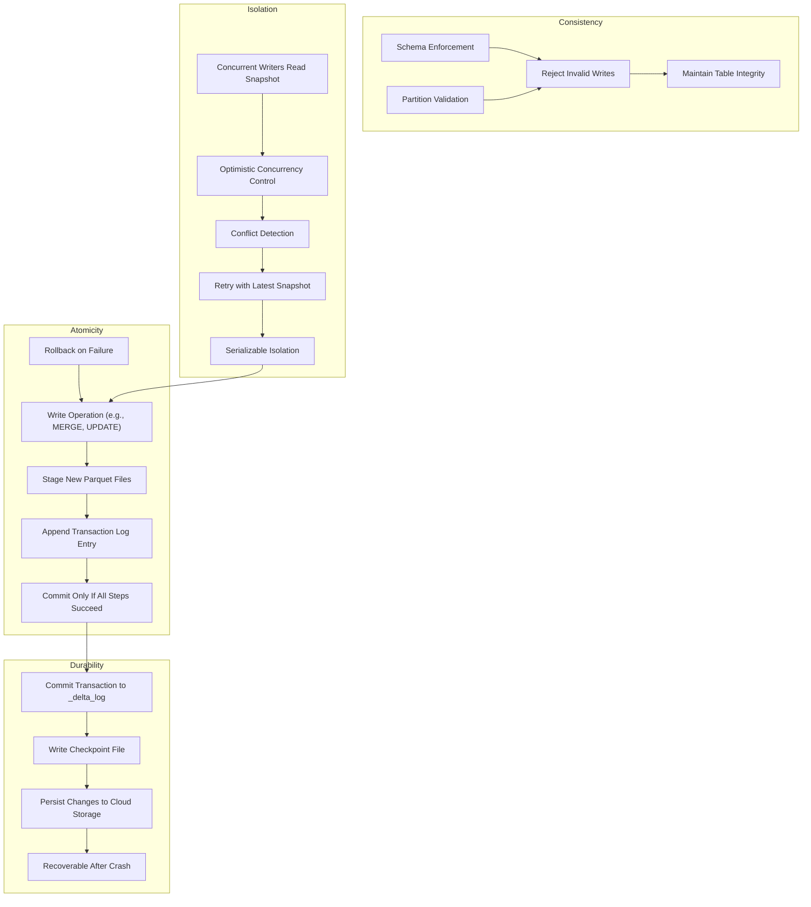
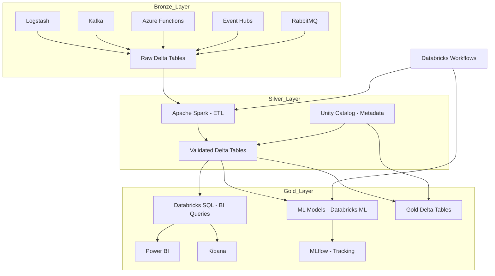
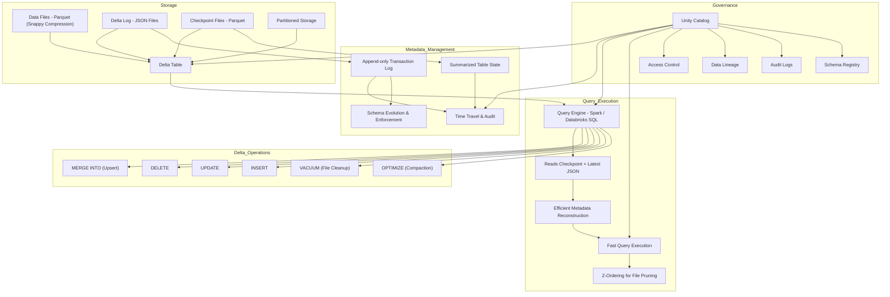
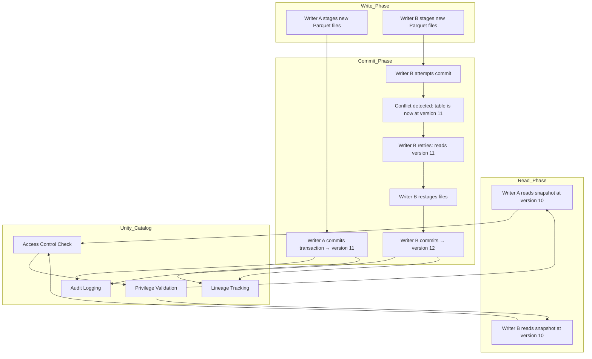
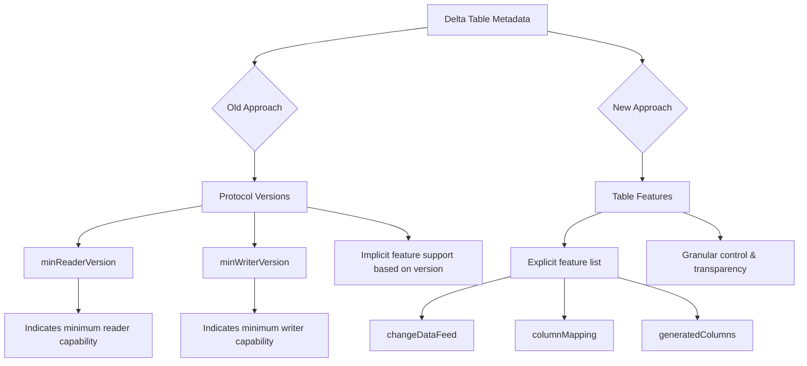

# Delta Lake - The Definitive Guide

* Understand key data reliability challenges and how Delta Lake solves them
* Explain the critical role of Delta transaction logs as a single source of truth
* Architect data lakehouses with the Medallion Architecture
* Optimize Delta Lake performance with features like deletion vectors and liquid clustering


Delta Lake is an **open source** revolutionizing data architectures by combining the best of data lakes and warehouses into the lakehouse architecture.

- Build scalable, reliable, high-performance data architectures.
- Delta Lake APIs
- Delta Lake is much more than Apache Parquet with a commit log


## Performance Tuning: Optimizing Your Data Pipelines with Delta Lake”

* Z-Ordering, liquid clustering, table statistics, and performance considerations.


## Chapter 1. Introduction to the Delta Lake Lakehouse Format

Delta Lake was initially designed to address data integrity issues around petabytes-scale systems.

The Delta Lake lakehouse format was developed to address the limitations of traditional data lakes and data warehouses. It provides ACID (atomicity, consistency, isolation, and durability) transactions and scalable metadata handling and unifies various data analytics tasks, such as batch and streaming workloads, machine learning, and SQL, on a single platform.

## Data Warehousing, Data Lakes, and Data Lakehouses

### Data Warehousing

Data warehouses are purpose-built to aggregate and process large amounts of structured data quickly. To protect this data, they typically use relational databases to provide ACID transactions, a step that is crucial for ensuring data integrity for business applications.

While robust, data warehouses are often hard to scale to handle the large volumes, variety of analytics (including event processing and data sciences), and data velocity typical in big data scenarios. This limitation is a critical factor that often necessitates using more scalable solutions such as data lakes or distributed processing frameworks like Apache Spark.

### Data lakes

Data lakes are scalable storage repositories (HDFS, cloud object stores such as Amazon S3, ADLS Gen2, and GCS, and so on) that hold vast amounts of raw data in their native format until needed.

Unlike traditional databases, data lakes are designed to handle an internet-scale volume, velocity, and variety of data (e.g., structured, semistructured, and unstructured data). These attributes are commonly associated with big data. Data lakes changed how we store and query large amounts of data because they are designed to scale out the workload across multiple machines or nodes. They are file-based systems that work on clusters of commodity hardware. 

Traditionally, data warehouses were scaled up on a single machine; note that massively parallel processing data warehouses have existed for quite some time but were more expensive and complex to maintain. Also, while data warehouses were designed for structured (or tabular) data, data lakes can hold data in the format of one’s choosing, providing developers with flexibility for their data storage.

While data lakes could handle all your data for data science and machine learning, they are an inherently unreliable form of data storage. Instead of providing ACID protections, these systems follow the BASE model

The lack of ACID guarantees means the storage system processing failures leave your storage in an inconsistent state with orphaned files. Subsequent queries to the storage system include files that should not result in duplicate counts (i.e., wrong answers).

Together, these shortcomings can lead to an infrastructure poorly suited for BI queries, inconsistent and slow performance, and quite complex setups. Often, the creation of data lakes leads to unreliable data swamps instead of clean data repositories due to the lack of transaction protections, schema management, and so on.

| Property        | ACID Model                                      | BASE Model                                         |
|----------------|--------------------------------------------------|----------------------------------------------------|
| **Stands for** | Atomicity, Consistency, Isolation, Durability    | Basically Available, Soft State, Eventually Consistent |
| **Consistency**| Strong consistency guaranteed                    | Eventual consistency (may be temporarily inconsistent) |
| **Availability**| May sacrifice availability for consistency      | Prioritizes availability over consistency          |
| **System Type**| Traditional relational databases (e.g., PostgreSQL, Oracle) | Distributed systems and NoSQL databases (e.g., Cassandra, DynamoDB) |
| **Transaction Handling** | Strict, all-or-nothing transactions       | Flexible, partial updates allowed                  |
| **Failure Recovery** | Rollbacks ensure clean state                | May leave system in soft or intermediate state     |
| **Use Case**    | Banking, financial systems, inventory management | Social media, real-time analytics, large-scale web apps |
| **Data Integrity** | High—ensures correctness and reliability       | Lower—tolerates temporary inconsistencies          |

BASE model provides:

| BASE Property         | Description                                                                 | Real-World Examples                          |
|-----------------------|-----------------------------------------------------------------------------|----------------------------------------------|
| **Basically Available** | The system guarantees availability—even if some data is stale or incomplete. | Amazon DynamoDB, Couchbase, Cassandra        |
| **Soft State**         | The system’s state may change over time—even without input—due to eventual updates or background processes. | Redis, MongoDB                               |
| **Eventually Consistent** | Data will become consistent over time, but not immediately. Temporary inconsistencies are tolerated. | Apache Cassandra, Riak, Amazon S3            |


### Lakehouses (or data lakehouses)

Databricks Lakehouse => Combines data warehouse and data lake features using Delta Lake.

The lakehouse combines the best elements of data lakes and data warehouses for OLAP workloads. It merges the scalability and flexibility of data lakes with the management features and performance optimization of data warehouses.

As the practice of data engineering evolved, the concept of the lakehouse was born. A lakehouse eliminates the need for disjointed systems and provides a single, coherent platform for all forms of data analysis. Lakehouses enhance the performance of data queries and simplify data management, making it easier for organizations to derive insights from their data.

Delta Lake, Apache Iceberg, and Apache Hudi are the most popular open source lakehouse formats.


## Project Tahoe to Delta Lake

Lake Tahoe is an iconic and massive lake in California, symbolizing the large-scale data lake the project aimed to create.

The transition from “Tahoe” to “Delta Lake” occurred around New Year’s 2018 and came from Jules Damji. The rationale behind changing the name was to invoke the natural process in which rivers flow into deltas, depositing sediments that eventually build up and create fertile ground for crops. This metaphor was fitting for the project, as it represented the convergence of data streams into a managed data lake, where data practitioners could cultivate valuable insights. The Delta name also resonated with the project’s architecture, which was designed to handle massive and high-velocity data streams, allowing the data to be processed and split into different streams or views.

But why did Armbrust create Delta Lake? He created it to address the limitations of Apache Spark’s file synchronization. Specifically, he wanted to handle large-scale data operations and needed robust transactional support. Thus, his motivation for developing Delta Lake stemmed from the need for a scalable transaction log that could handle massive data volumes and complex operations.

Early in the creation of Delta Lake are two notable use cases that emphasize its efficiency and scalability. Comcast utilized Delta Lake to enhance its data analytics and machine learning platforms and manage its petabytes of data. This transition reduced its compute utilization from 640VMs to 64VMs and simplified job maintenance from 84 to 3 jobs. By streamlining its processing with Delta Lake, Comcast reduced its compute utilization by 10x, with 28x fewer jobs. Apple’s information security team employed Delta Lake for real-time threat detection and response, handling over 300 billion events per day and writing hundreds of terabytes of data daily. Both cases illustrate Delta Lake’s superior performance and cost-effectiveness compared to traditional data management methods.

## What Is Delta Lake?

Delta Lake is an open source storage layer that supports ACID transactions, scalable metadata handling, and unification of streaming and batch data processing. It was initially designed to work with Apache Spark and large-scale data lake workloads.

With Delta Lake, you can build a single data platform with your choice of high-performance query engine to address a diverse range of workloads, including (but not limited to) business intelligence (BI), streaming analytics/complex event processing, data science, and machine learning.


However, as it has evolved, Delta Lake has been optimally designed to work with numerous workloads (small data, medium data, big data, etc.). It has also been designed to work with multiple frameworks (e.g., Apache Spark, Apache Flink, Trino, Presto, Apache Hive, and Apache Druid), services (e.g., Athena, Big Query, Databricks, EMR, Fabric, Glue, Starburst, and Snowflake), and languages (.NET, Java, Python, Rust, Scala, SQL, etc.).

Here's a comprehensive comparison table of **high-performance query engines** that integrate with **Delta Lake**, tailored for different analytics and data engineering needs:

### High-Performance Query Engines for Delta Lake

| Query Engine       | Integration Type       | Best Use Case                         | Performance Features                          | Language Support       |
|--------------------|------------------------|----------------------------------------|------------------------------------------------|------------------------|
| **Apache Spark**   | Native                 | Batch + Streaming + ML                | Catalyst optimizer, vectorized execution       | Scala, Python, SQL     |
| **Databricks SQL** | Native (Databricks)    | Interactive analytics, BI             | Photon engine, dynamic file pruning            | SQL                    |
| **Trino**          | Connector-based        | Federated queries, ad hoc analytics   | Distributed SQL engine, low-latency execution  | SQL                    |
| **Apache Hive**    | Metastore integration  | Legacy Hadoop, batch ETL              | Tez engine, LLAP for interactive queries       | HiveQL, SQL            |
| **StarTree (Pinot)** | Connector-based     | Real-time analytics, dashboards       | Columnar storage, indexing, low-latency reads  | SQL                    |
| **Daft**           | Native Python API      | ML pipelines, ETL, data science       | Partition pruning, parallel reads              | Python                 |

### Common Use Cases

Developers in all types of organizations, from startups to large enterprises, use Delta Lake to manage their big data and AI workloads. Common use cases include:

> ***Modernizing data lakes:***
>
> Delta Lake helps organizations modernize their data lakes by providing ACID transactions, scalable metadata handling, and schema enforcement, thereby ensuring data reliability and performance improvements.

> ***Data warehousing:***
>
> There are both data warehousing technologies and techniques. The Delta Lake lakehouse format allows you to apply data warehousing techniques to provide fast query performance for various analytics workloads while also providing data reliability.

> ***Machine learning/data science:***
>
> Delta Lake provides a reliable data foundation for machine learning and data science teams to access and process data, enabling them to build and deploy models faster.

> ***Streaming data processing:***
>
> Delta Lake unifies streaming and batch data processing. This allows developers to process real-time data and perform complex transformations on the fly.

> ***Data engineering:***
>
> Delta Lake provides a reliable and performant platform for data engineering teams to build and manage data pipelines, ensuring data quality and accuracy.

> ***Business intelligence:***
>
> Delta Lake supports SQL queries, making it easy for business users to access and analyze data and thus enabling them to make data-driven decisions.

Overall, Delta Lake is used by various teams, including data engineers, data scientists, and business users, to manage and analyze big data and AI workloads, ensuring data reliability, performance, and scalability.

### Key Features

Delta Lake comprises the following key features that are fundamental to an open lakehouse format:

> ***ACID transactions***
> 
> Delta Lake ensures that data modifications are performed atomically, consistently, in isolation, and durably, i.e., with ACID transaction protections. This means that when multiple concurrent clients or tasks access the data, the system maintains data integrity. For instance, if a process fails during a data modification, Delta Lake will roll back the changes, ensuring that the data remains consistent.



> ***Scalable metadata***
> 
> The metadata of a Delta Lake table is the **transaction log**, which provides transactional consistency per the aforementioned ACID transactions. With a petabyte-scale table, the table’s metadata can itself be exceedingly complicated to maintain. Delta Lake’s scalable metadata handling feature is designed to manage metadata efficiently for large-scale datasets without its operations impacting query or processing performance.

> ***Time travel***
> 
> The Delta Lake time travel feature allows you to query previous versions of a table to access historical data. Made possible by the **Delta transaction log**, it enables you to specify a version or timestamp to query a specific version of the data. This is very useful for a variety of use cases, such as data audits, regulatory compliance, and data recovery.

> ***Unified batch/streaming***
>
> Delta Lake was designed hand in hand with Apache Spark Structured Streaming to simplify the logic around streaming. Instead of having different APIs for batch and streaming, Structured Streaming uses the same in-memory Datasets/DataFrame API for both scenarios. This allows developers to use the same business logic and APIs, the only difference being latency. Delta Lake provides the ACID guarantees of the storage system to support this unification.

> ***Schema evolution/enforcement***
>
> Delta Lake’s schema evolution and schema enforcement ensure data consistency and quality by enforcing a schema on write operations and allowing users to modify the schema without breaking existing queries. They also prevent developers from inadvertently inserting data with incorrect columns or types, which is crucial for maintaining data quality and consistency.

> ***Audit history***
>
> This feature provides detailed logs of all changes made to the data, including information about who made each change, what the change was, and when it was made. This is crucial for compliance and regulatory requirements, as it allows users to track changes to the data over time and ensure that data modifications are performed correctly. The Delta transaction log makes all of this possible.


## Unified Data Platform on Azure: Medallion Architecture with Delta Lake and Databricks



## Overview of Delta Lake Operations



## Concurrent Writes Isolation



## Anatomy of a Delta Lake Table

> ***Data files***
>
> Delta Lake tables store data in Parquet file format. These files contain the actual data and are stored in a distributed cloud or on-premises file storage system such as HDFS (Hadoop Distributed File System), Amazon S3, Azure Blob Storage (or Azure Data Lake Storage [ADLS] Gen2), GCS (Google Cloud Storage), or MinIO. Parquet was chosen for its efficiency in storing and querying large datasets.

> ***Transaction Log (Delta Log)***
> 
> It is an ordered record of every transaction performed on a Delta Lake table. The transaction log ensures ACID properties by recording all changes to the table in a series of JSON files. Each transaction is recorded as a new JSON file in the _delta_log directory, which includes metadata about the transaction, such as the operation performed, the files added or removed, and the schema of the table at the time of the transaction.

> ***Metadata***
> 
> Metadata in Delta Lake includes information about the table’s schema, partitioning, and configuration settings. This metadata is stored in the transaction log and can be retrieved using SQL, Spark, Rust, and Python APIs. The metadata helps manage and optimize the table by providing information for schema enforcement and evolution, partitioning strategies, and data skipping.

> ***Schema***
>
> A Delta Lake table’s schema defines the data’s structure, including its columns, data types, and so on. The schema is enforced on write, ensuring that all data written to the table adheres to the defined structure. Delta Lake supports schema evolution (add new columns, rename columns, etc.), allowing the schema to be updated as the data changes over time.

> ***Checkpoints***
> 
> Checkpoints are periodic snapshots of the transaction log that help speed up the recovery process. Delta Lake consolidates the state of the transaction log by default every 10 transactions. This allows client readers to quickly catch up from the most recent checkpoint rather than replaying the entire transaction log from the beginning. Checkpoints are stored as Parquet files and are created automatically by Delta Lake.

## Delta Transaction Protocol

The Delta transaction log protocol is the specification defining how clients interact with the table in a consistent manner. At its core, all interactions with the Delta table must begin by reading the Delta transaction log to know what files to read. When a client modifies the data, the client initiates the creation of ne data files (i.e., Parquet files) and then inserts new metadata into the transaction log to commit modifications to the table. 

In fact, many of the original Delta Lake integrations (delta-spark, Trino connector, delta-rust API, etc.) had codebases maintained by different communities. A Rust client could write, a Spark client could modify, and a Trino client could read from the same Delta table without conflict because they all independently followed the same protocol.

Implementing this specification brings ACID properties to large data collections stored as files in a distributed filesystem or object store. As defined in the specification, the protocol was designed with the following goals in mind:

> ***Serializable ACID writes***
>
> Multiple writers can modify a Delta table concurrently while maintaining ACID semantics.
>
> Serializable isolation is the strictest level of isolation in database systems. It ensures that:
>
> * Transactions behave as if they were executed one after another, even if they run concurrently.
>
> In Delta Lake, this means that concurrent writes to the same table are conflict-checked and serialized to maintain consistency.

> ***Snapshot isolation for reads***
>
> Readers can read a consistent snapshot of a Delta table, even in the face of concurrent writes.

> ***Scalability to billions of partitions or files***
>
> Queries against a Delta table can be planned on a single machine or in parallel.

> ***Self-describing***
>
> All metadata for a Delta table is stored alongside the data. This design eliminates the need to maintain a separate metastore to read the data and allows static tables to be copied or moved using standard filesystem tools.

> ***Support for incremental processing***
>
> Readers can tail the Delta log to determine what data has been added in a given period of time, allowing for efficient streaming.

## What Is Serializable Isolation?

**Serializable isolation** is the strictest level of isolation in database systems. It ensures that:

*   Transactions behave as if they were executed **one after another**, even if they run concurrently.
*   No anomalies like **dirty reads**, **non-repeatable reads**, or **phantom reads** occur.

In Delta Lake, this means that **concurrent writes** to the same table are **conflict-checked** and **serialized** to maintain consistency.

Delta uses Optimistic Concurrency Control (OCC):

* Multiple writers can attempt updates.
* If conflicts occur, one transaction retries.

***

### How Delta Lake Implements Serializable ACID Writes

Delta Lake uses a combination of **transaction logs**, **versioning**, and **optimistic concurrency control**:

#### 1. **Transaction Log (`_delta_log`)**

*   Every write operation appends a **new JSON file** to the `_delta_log` directory.
*   This log records metadata, schema changes, and data file additions/removals.

#### 2. **Optimistic Concurrency Control**

*   Writers read the current state of the table (a snapshot).
*   They prepare changes based on that snapshot.
*   Before committing, Delta Lake checks if the snapshot is still valid (i.e., no conflicting changes occurred).
*   If a conflict is detected (e.g., overlapping data files), the transaction **fails** and must be retried.

#### 3. **Conflict Detection**

*   Delta Lake checks for **overlapping data files** or **schema changes**.
*   If two transactions modify the same part of the data, one will be rejected to preserve serializability.

#### 4. **Atomic Commit**

*   If no conflicts are found, the transaction is committed by writing a new log entry.
*   The commit is **atomic**—either all changes are applied, or none are.

***

### Benefits of Serializable Writes in Delta

*   **Data Integrity**: Prevents corruption from concurrent writes.
*   **Consistency**: Guarantees that readers always see a consistent snapshot.
*   **Scalability**: Works well in distributed environments like Spark or Databricks.

***

## The Logic Behind “Atomicity”

In computer science, **atomic** means something that **cannot be broken down further**—it’s indivisible. This concept is borrowed from physics, where an atom was once thought to be the smallest unit of matter.

In the context of **transactions**:

*   An **atomic transaction** is treated as a **single, indivisible unit of work**.
*   Even if the transaction involves multiple steps (e.g., writing to several files or updating multiple rows), the system guarantees that **either all steps succeed**, or **none are applied**.
*   This prevents **partial updates**, which could leave the system in an inconsistent or corrupt state.

***

### Why It’s Like Flipping a Switch

Think of a light switch:

*   You flip it **on** → the light is fully on.
*   You flip it **off** → the light is fully off.
*   You **don’t** want a situation where the switch is halfway and the light flickers unpredictably.

Similarly, in a database:

*   You **commit** a transaction → all changes are applied.
*   You **abort** a transaction → no changes are applied.
*   You **never** want a situation where **some changes are applied and others are not**.


***

### What Is Metadata in Delta Tables?

> "All metadata for a Delta table is stored alongside the data. This design eliminates the need to maintain a separate metastore to read the data and allows static tables to be copied or moved using standard filesystem tools."


Metadata is a key architectural feature of **Delta Lake**, and it has several implications includes:

*   **Schema information** (column names, types)
*   **Partitioning details**
*   **Transaction history**
*   **File-level changes** (additions/removals)
*   **Table versions**

In traditional systems (like Hive or relational databases), this metadata is stored in a **central metastore** (e.g., Hive Metastore or AWS Glue). But Delta Lake takes a different approach.

***

### Metadata Stored Alongside Data

Delta Lake stores metadata in a special folder called `_delta_log` **within the same directory as the data files**. This folder contains:

*   **JSON files**: Each file represents a transaction (add/remove files, schema changes).
*   **Checkpoint files**: Periodic Parquet files that summarize the state for faster reads.

This means:

*   The **data and its metadata live together** in the same location.
*   You don’t need an external system to interpret the table structure or history.

***

### Why This Matters: Portability & Simplicity

Because everything is self-contained:

*   You can **copy or move** a Delta table using standard tools like `cp`, `mv`, or cloud storage commands.
*   The table remains **fully readable and queryable** in its new location.
*   No need to **re-register** the table in a metastore or worry about losing schema definitions. Unless when transferring from hlivemetastore to Unit Catalog.

This is especially useful for:

*   **Archiving** tables
*   **Sharing** data across environments
*   **Disaster recovery**
*   **Versioning and reproducibility**

***

### Example Scenario

Imagine you have a Delta table stored at `/mnt/data/sales/`. It contains:

*   Data files (Parquet)
*   `_delta_log/` folder with metadata

You can:

*   Copy the entire folder to `/mnt/archive/sales_backup/`
*   Open it in another Spark session and query it directly:
    ```python
    spark.read.format("delta").load("/mnt/archive/sales_backup/").show()
    ```

No metastore registration needed. The schema and history are preserved.

***


### What Does “Registering” a Table Mean?

**Registering a table** means making it **discoverable and queryable** through a **metastore or catalog**. It involves:

*   Giving the table a **logical name** (e.g., `sales_data`)
*   Associating it with a **location** (e.g., `/mnt/delta/sales_data`)
*   Storing its metadata (schema, partitions, etc.) in the catalog

This allows you to query it like:

```sql
SELECT * FROM catalog.schema.sales_data
```

Without registration, you can still query the table using its **file path**, but it won’t be part of the catalog.

***

### Moving from Hive Metastore to Unity Catalog

When you move from Hive Metastore to Unity Catalog:

1.  **Delta tables stored in the filesystem remain unchanged**.
2.  But if you want to **query them using Unity Catalog**, you need to **register them in Unity Catalog**.

This involves:

*   Creating a **schema** (database) in Unity Catalog.
*   Using a command like:
    ```sql
    CREATE TABLE catalog.schema.table_name
    USING DELTA
    LOCATION 'abfss://container@account.dfs.core.windows.net/path/to/table'
    ```

This tells Unity Catalog:

*   “Here’s a table stored at this location.”
*   “Track its metadata and make it available for governance, access control, lineage, etc.”

***

### Summary

| Concept                    | Hive Metastore                              | Unity Catalog                                |
| -------------------------- | ------------------------------------------- | -------------------------------------------- |
| Metadata location          | External metastore                          | Unity Catalog                                |
| Table registration needed? | Yes (for named access)                      | Yes (for named access)                       |
| Can query by path?         | Yes                                         | Yes                                          |
| Benefits of registration   | Easier querying, governance, access control | Same, plus fine-grained security and lineage |

***


## PySpark Script to Test Atomicity & Isolation

```python
from pyspark.sql import SparkSession
from delta.tables import DeltaTable
import time

# Initialize Spark session with Delta support
spark = SparkSession.builder \
    .appName("DeltaAtomicityTest") \
    .config("spark.sql.extensions", "io.delta.sql.DeltaSparkSessionExtension") \
    .config("spark.sql.catalog.spark_catalog", "org.apache.spark.sql.delta.catalog.DeltaCatalog") \
    .getOrCreate()

# Create a Delta table
data = spark.createDataFrame([
    (1, "Alice", 100),
    (2, "Bob", 200)
], ["id", "name", "balance"])

data.write.format("delta").mode("overwrite").save("/tmp/delta-table")

# Load the Delta table
delta_table = DeltaTable.forPath(spark, "/tmp/delta-table")

# Transaction A: Update balance for id=1
def transaction_a():
    spark.sql("BEGIN")
    delta_table.update(
        condition="id = 1",
        set={"balance": "balance + 50"}
    )
    time.sleep(5)  # Simulate delay
    spark.sql("COMMIT")

# Transaction B: Concurrent update to same row
def transaction_b():
    spark.sql("BEGIN")
    delta_table.update(
        condition="id = 1",
        set={"balance": "balance - 30"}
    )
    spark.sql("COMMIT")

# Run transactions
from threading import Thread

t1 = Thread(target=transaction_a)
t2 = Thread(target=transaction_b)

t1.start()
t2.start()

t1.join()
t2.join()

# Show final state
spark.read.format("delta").load("/tmp/delta-table").show()
```

***

### What You’ll Observe

*   If both transactions try to update the same row, **Delta Lake will detect a conflict**.
*   One transaction will **fail**, and the table will remain **consistent**.
*   You’ll see that **only one update is applied**, proving **atomicity** and **serializable isolation**.

***


## Understanding the Delta Lake Transaction Log at the File Level


To better understand this in action, let’s look at what happens at the file level when a Delta table is created. Initially, the table’s transaction log is automatically created in the *_delta_log* subdirectory. As changes are made to the table, the operations are recorded as ordered atomic commits in the transaction log. Each commit is written out as a JSON file, starting with 000...00000.json. Additional changes to the table generate subsequent JSON files in ascending numerical order, so that the next commits are written out as `000...00001.json`,`000...00002.json`, and so on. Each numeric JSON file increment represents a new version of the table.

Note how the structure of the data files has not changed; they exist as separate Parquet files generated by the query engine or language writing to the Delta table. If your table utilizes Hive-style partitioning, you will retain the same structure.

## The Single Source of Truth

Delta Lake allows multiple readers and writers of a given table to all work on the table at the same time. It is the central repository that tracks all user changes to the table. This concept is important because, over time, processing jobs will invariably fail in your data lake. The result is partial files that are not removed. Subsequent processing or queries will not be able to ascertain which files should or should not be included in their queries. To show users correct views of the data at all times, the Delta log is the **single source of truth**.

## The Relationship Between Metadata and Data

As the Delta transaction log is the single source of truth, any client who wants to read or write to your Delta table *must* first query the transaction log. For example, when inserting data while creating our Delta table, we initially generate two Parquet files: `1.parquet` and `2.parquet`. This event would automatically be added to the transaction log and saved to disk as commit `000...00000.json`.


In a subsequent command (B), we run a DELETE operation that results in the removal of rows from the table. Instead of modifying the existing Parquet files (1.parquet, 2.parquet), Delta creates a third file (3.parquet).


## Why Delta Lake Writes New Files Instead of Modifying Existing Ones?

Delta Lake is built on **immutable data files** (Parquet), and it uses a **transaction log** to track changes. This design offers several advantages:

1.  **Atomicity and Consistency**: By writing new files and updating the transaction log, Delta ensures ACID compliance. This means operations like `DELETE`, `UPDATE`, and `MERGE` are atomic and consistent.

2.  **Time Travel and Auditability**: Because old files are not deleted immediately, you can query previous versions of the data. This is useful for debugging, auditing, and rollback.

3.  **Concurrency and Scalability**: Multiple writers and readers can operate concurrently without corrupting the data, thanks to the log-based architecture.

***

### Impact on Memory and Storage

This approach **does use more storage** in the short term:

*   **New files for every change**: Each operation creates new Parquet files, which increases disk usage.
*   **Old files retained temporarily**: Until a **vacuum** operation is run, old files remain on disk.

However, **memory usage** is not significantly impacted because:

*   Delta Lake operations are optimized for distributed processing (e.g., via Apache Spark).
*   The transaction log is lightweight and only contains metadata about file changes.

***

### Mitigating Storage Growth

Delta Lake provides tools to manage storage:

*   **Vacuum**: Removes obsolete files no longer referenced by the transaction log.
*   **Data Skipping and Z-Ordering**: Helps reduce the amount of data read during queries, improving performance.
*   **Compaction**: You can periodically compact small files into larger ones to optimize storage and query efficiency.

***

### Trade-Off Summary

| Feature            | Delta Lake             | Traditional Approach |
| ------------------ | ---------------------- | -------------------- |
| **Storage Usage**  | Higher (temporarily)   | Lower                |
| **Data Integrity** | Strong (ACID)          | Often weaker         |
| **Concurrency**    | High                   | Limited              |
| **Time Travel**    | Supported              | Rare                 |
| **Performance**    | Optimized for big data | Varies               |


## Multiversion Concurrency Control (MVCC) File and Data Observations

MVCC is a technique used in databases to allow **multiple users to read and write data at the same time** without interfering with each other. It works by **creating versions of data** instead of modifying it directly.

---

### How Delta Lake Uses MVCC with Parquet Files
Delta Lake stores data in **Parquet files** on object stores (like cloud storage). When you delete rows from a table:

- **Instead of editing existing files**, Delta Lake creates **new files** that contain only the rows that weren’t deleted.
- This is **faster** and supports MVCC because:
  - Old files remain untouched (preserving older versions).
  - New files represent the updated version.
  - Readers and writers can safely access different versions.

---

### Time Travel and Atomicity
Because Delta Lake keeps **multiple versions of files**, it can:
- Let users **"time travel"** to older versions of the data.
- Ensure **atomic operations** (all-or-nothing changes) using transaction logs.

---

### Transaction Logs and File Versions
Delta Lake uses JSON transaction logs to track changes:

- **000...00000.json**: Points to original files (`1.parquet`, `2.parquet`).
- **000...00001.json**: Records a delete and add operation:
  - **Remove**: Marks `1.parquet` and `2.parquet` as deleted (soft delete).
  - **Add**: Adds `3.parquet` with the updated data.
  - **Only `3.parquet` is used** when querying the latest version.

---

### Reading Parquet Files Directly
If someone reads the Parquet files **without using the Delta transaction log**, they might see **duplicate rows** because:
- Old files (`1.parquet`, `2.parquet`) still exist.
- New file (`3.parquet`) also contains some of the same rows.

---

### What Is VACUUM?
- The **remove operation is soft**—files are marked as deleted but not physically removed.
- To **permanently delete** old files, you run the **VACUUM** command.

---

### Time Travel in Action
- If you query an **older version** of the table, Delta Lake uses the **older transaction log** to point to the original files (`1.parquet`, `2.parquet`).
- This lets you see the data **as it was before the delete**.

---

### What Are Deletion Vectors?

A **deletion vector** is a lightweight data structure that tracks which rows in a Parquet file are logically deleted **without physically rewriting the file**. Instead of creating a new file that excludes deleted rows, Delta Lake can:

- Leave the original Parquet file **unchanged**
- Store a **bitmap or list of row indices** that are considered deleted
- Apply this vector at **query time** to filter out deleted rows

---

### Why Are Deletion Vectors Faster?

Without deletion vectors:
- Deleting rows requires **rewriting files** (expensive on object stores)
- This leads to **more I/O**, **more files**, and **longer commit times**

With deletion vectors:
- No need to rewrite files
- Deletes are **metadata-only operations**
- Faster commits and **less storage churn**

---

### MVCC + Deletion Vectors = Supercharged Time Travel

Deletion vectors still support **Multiversion Concurrency Control (MVCC)**:
- Older versions of the table still point to the original files **without** the deletion vector
- Newer versions apply the deletion vector to **logically exclude** rows
- This preserves **time travel** and **snapshot isolation** without file duplication

---

###  What About VACUUM?

Eventually, if a file has too many deleted rows, Delta Lake may still **rewrite** it during compaction or VACUUM to reclaim space. But deletion vectors **delay and reduce** the need for this, optimizing both performance and cost.

## Observing the Interaction Between the Metadata and Data


The flow in the image represents a common data processing failure scenario. The table is initially represented by two Parquet files (1.parquet and 2.parquet) at t0.

At t1, job 1 extracts file 3 and file 4 and writes them to storage. However, due to some error (network hiccup, storage temporarily offline, etc.), an incomplete portion of file 3 and none of file 4 are written into 3.parquet. Thus, 3.parquet is a partial file, and this incomplete data will be returned to any clients that subsequently query the files that make up this table.

To complicate matters, at t2, a new version of the same processing job (job 1 v2) successfully completes its task. It generates a new version of 3.parquet and 4.parquet. But because the partial 3’.parquet (circled) exists alongside 3.parquet, any system querying these files will result in double counting.

However, because the Delta transaction log tracks which files are valid, we can avoid the preceding scenario. Thus, when a client reads a Delta Lake table, the engine (or API) initially verifies the transaction log to see what new transactions have been posted to the table. It then updates the client table with any new changes. This ensures that any client’s version of a table is always synchronized. Clients cannot make divergent, conflicting changes to a table.


Let’s repeat the same partial file example on a Delta Lake table. Figure above shows the same scenario in which the table is represented by two Parquet files (i.e., 1.parquet and 2.parquet) at t0. The transaction log records that these two files make up the Delta table at t0 (Version 0).

At t1, job 1 fails with the creation of 3.parquet. However, because the job failed, the transaction was not committed to the transaction log. No new files are recorded; notice how the transaction log has only 1.parquet and 2.parquet listed. Any queries against the Delta table at t1 will read only these two files, even if other files are in storage.

At t2, job 1 v2 is completed, and its output is the files 3.parquet and 4.parquet. Because the job was successful, the Delta log includes entries only for the two successful files. That is, 3’.parquet is not included in the log. Therefore, any clients querying the Delta table at t2 will see only the correct files.

## Table Features

Originally, Delta tables used protocol versions to map to a set of features to ensure user workloads did not break when new features in Delta were released. For example, if a client wanted to use Delta’s Change Data Feed (CDF) option, users were required to upgrade their protocol versions and validate their workloads to access new features. This ensured that any readers or writers incompatible with a specific protocol version were blocked from reading or writing to that table to prevent data corruption


But this process slows feature adoption because it requires the client and table to support all features in that protocol version. For example, with protocol version 4, your Delta table supports both generated columns and CDF. For your client to read this table, it must support both generated columns and Change Data Feed even if you only want to use CDF. In other words, Delta connectors have no choice but to implement all features just to support a single feature in the new version.

Introduced in Delta Lake 2.3.0, Table Features replaces table protocol versions to represent features a table uses so connectors can know which features are required to read or write a table 


The advantage of this approach is that any connectors (or integrations) can selectively implement certain features of their interest, instead of having to work on all of them. A quick way to view what table features are enabled is to run the query SHOW TBLPROPERTIES:

```ini
SHOW TBLPROPERTIES default.my_table;
```

The output would look similar to the following:

```ini
Key (String)                         Value (String)
delta.minReaderVersion               3
delta.minWriterVersion               7
delta.feature.deletionVectors        supported
delta.enableDeletionVectors          true
delta.checkpoint.writeStatsAsStruct  true
delta.checkpoint.writeStatsAsJson    false
````

To dive deeper, please refer to [“Table Features” in the GitHub page for the Delta transaction protocol](https://github.com/delta-io/delta/blob/master/PROTOCOL.md#table-features).



## Delta Kernel


Building your own **Delta Kernel connector** can be very valuable if you’re working with Delta Lake and need tight integration with your own query engine, data processing framework, or specialized environment. Let me break down why you might want to do this:

---

### Reasons to Build Your Own Kernel Connector

- **Custom Query Engine Integration**  
  If you’re using a query engine (like Flink, Presto, Trino, or a proprietary system) that doesn’t yet have native Delta Lake support, a connector lets you read/write Delta tables directly.

- **Leverage Delta’s Transaction Log**  
  Delta Lake’s `_delta_log` provides ACID guarantees. A connector ensures your engine can interpret the log correctly, apply schema evolution, and handle updates/inserts/deletes consistently.

- **Performance Optimization**  
  You can tailor the connector to your workload:
  - Push down filters and projections for efficiency.  
  - Optimize how data files are scanned.  
  - Integrate with your engine’s caching or indexing mechanisms.

- **Language/Runtime Flexibility**  
  Delta Kernel APIs are designed to be language-agnostic. If your stack is in Rust, C++, or another language, building a connector lets you use Delta Lake without relying on Spark or JVM-based tools.

- **Streaming & Real-Time Use Cases**  
  For systems like Flink or Kafka Streams, a connector enables consuming Delta tables as a streaming source or writing streaming outputs with transactional guarantees.

- **Control & Extensibility**  
  By building your own, you can:
  - Add custom metadata handling.  
  - Support domain-specific constraints.  
  - Extend Delta functionality (e.g., custom partitioning or indexing strategies).

---


### 🧩 Example Scenarios
- **DoorDash** built a Flink + Delta connector to power real-time pipelines, ensuring consistency between batch and streaming jobs.  
- **Rust-based engines** (like `delta-kernel-rs`) allow lightweight integration without JVM overhead.  
- **Custom ML pipelines** can use connectors to guarantee reproducible training datasets by reading consistent snapshots of Delta tables.

---

### ⚖️ Trade-offs
- **Effort**: Building a connector requires understanding Delta’s transaction protocol deeply.  
- **Maintenance**: You’ll need to keep it updated as Delta evolves.  
- **Alternatives**: If your engine already has a maintained connector, it’s usually better to use that instead of reinventing the wheel.

---

👉 In short: **you’d build your own Delta Kernel connector if you need direct, efficient, and reliable access to Delta tables from an environment that doesn’t already support them—or if you want to customize how Delta integrates with your system.**

You wouldn’t need to build your own **Delta Kernel connector** in environments where Delta Lake support is already **natively integrated and maintained**. In those cases, the platform or engine has already implemented the connector logic for you, so you can directly read/write Delta tables without worrying about the transaction protocol yourself.  

---

### 🌍 Environments with Native Delta Support
- **Databricks**  
  Delta Lake is fully embedded in the Databricks Runtime. All ACID guarantees, schema enforcement, and streaming/batch support are built-in.  

- **Apache Spark (with Delta Lake library)**  
  If you’re running Spark and include the Delta Lake library, you get direct APIs (`DeltaTable`, `MERGE`, `UPDATE`, etc.) without needing a custom connector.  

- **Flink (via official Delta connectors)**  
  The community and Delta project maintain Flink connectors, so you can stream into/out of Delta tables without building your own.  

- **Presto / Trino**  
  These query engines have official Delta Lake connectors that interpret the transaction log and expose Delta tables as queryable sources.  

- **Hive & Impala (via integrations)**  
  Delta Lake provides compatibility layers so these engines can query Delta tables without custom work.  

- **Rust / C++ via Delta Kernel RS**  
  The Delta team maintains a Rust implementation (`delta-kernel-rs`) that can be embedded into other systems, removing the need to build your own from scratch.  

---

👉 In short: **Databricks, Spark, Flink, Trino, Presto, Hive, and Impala already give you Delta support out of the box.** You’d only build your own connector if you’re working in an unsupported or highly specialized environment.  


## Whats ACID transactions?

Let’s put **ACID properties (Atomicity, Consistency, Isolation, Durability)** into the **context of Delta Lake**, which is a storage layer built on top of data lakes (like Apache Spark + Parquet) that brings transactional guarantees to big data.

---

### Atomicity in Delta Lake
- **Meaning**: Every write to a Delta table is atomic—either all changes are committed or none are.  
- **How it works**: Delta Lake uses a **transaction log (the `_delta_log` folder)** to record operations. If a job fails midway, no partial files are left visible to readers.  
- **Example**: If you’re inserting millions of rows, Delta Lake ensures that either all rows are added or none are, preventing “half-written” datasets.

---

### Consistency in Delta Lake
- **Meaning**: After a transaction, the table is always in a valid state that respects schema and constraints.  
- **How it works**: Delta Lake enforces **schema validation** and can reject writes that don’t match the expected structure.  
- **Example**: If your table requires a column `customer_id` to be non-null, Delta Lake ensures that no transaction can break this rule.

---

### Isolation in Delta Lake
- **Meaning**: Concurrent reads and writes don’t interfere with each other.  
- **How it works**: Delta Lake uses **snapshot isolation**. Readers always see a consistent snapshot of the data as of the last committed transaction, even if new writes are happening in parallel.  
- **Example**: If one job is appending new sales records while another is querying the table, the query sees only the committed state before the append finishes—no “dirty reads.”

---

### Durability in Delta Lake
- **Meaning**: Once a transaction is committed, it’s permanent—even if there’s a crash.  
- **How it works**: Delta Lake writes transaction logs to durable storage (like HDFS, S3, or Azure Data Lake). These logs ensure that committed changes can always be reconstructed.  
- **Example**: If you successfully merge data into a Delta table and the cluster crashes right after, the changes are still there when you restart.

---

### Putting It All Together
Delta Lake essentially brings **database-like reliability** to big data lakes:

| ACID Property | Delta Lake Mechanism | Benefit |
|---------------|----------------------|---------|
| Atomicity     | Transaction log, commit protocol | No partial writes |
| Consistency   | Schema enforcement, constraints | Valid data states |
| Isolation     | Snapshot isolation | Reliable concurrent reads/writes |
| Durability    | Persistent transaction log | Survives crashes |

---

In short, **Delta Lake makes your data lake behave like a transactional database**, ensuring correctness and reliability even at massive scale.  

## Questions to Help Remember

* What the metadata of a Delta Lake table consists of? What justifies their existence? What's its role?
* What's the secret of Delta Lake performance?
* What is Delta transaction log protocol
* What's the single source of truth in Delta tables?


# Can be useful for Atlas Migration

## Optimization Techniques

Delta Lake provides commands like OPTIMIZE and VACUUM to manage metadata and file layout:

* OPTIMIZE: Compacts small files into larger ones, reducing metadata overhead
* VACUUM: Cleans up old files and log entries to keep metadata lean


# Chapter 5

## Delta Lake Table Optimization


# Chapter 10. Performance Tuning: Optimizing Your Data Pipelines with Delta Lake

